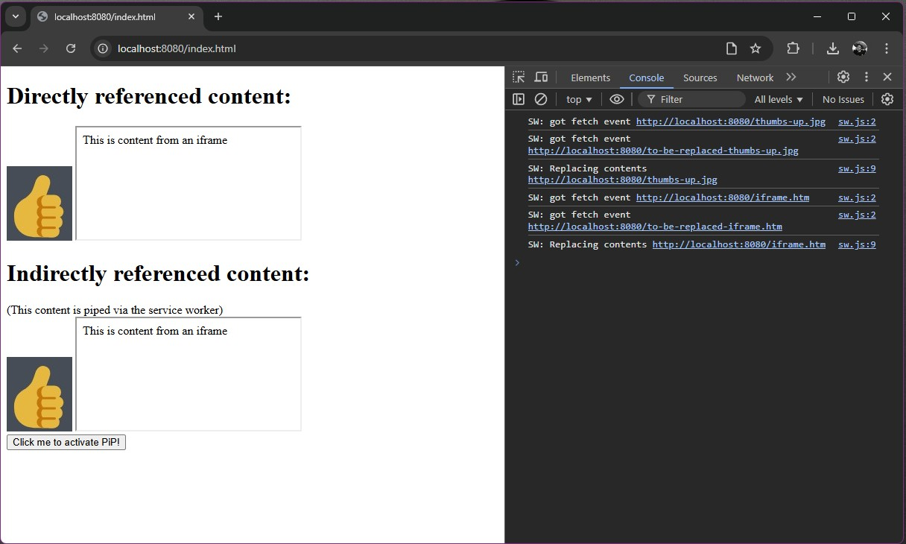
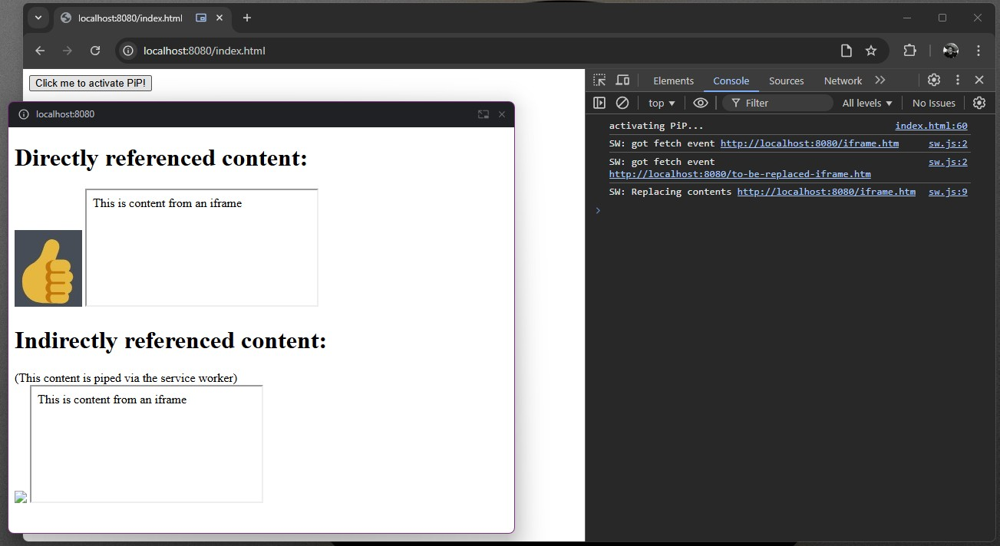

# MRE: Chrome bug: Service worker fetch event not triggered in PiP

This is an example for reproducing a bug in Chrome where the `fetch`
event is not triggered in the Service Worker for contents in a PiP.

[Link to this test on Github Pages](https://nytamin.github.io/reproduce-chrome-pip-bug/index.html)

## Premise

A web app is using the [fetch event](https://developer.mozilla.org/en-US/docs/Web/API/ServiceWorkerGlobalScope/fetch_event) in a Service Worker to intercept requests and serve content (images and iframes).

The web app also uses the [Picture-in-Picture (PiP) API](https://developer.mozilla.org/en-US/docs/Web/API/Picture-in-Picture_API) to display the contents in a PiP.

## What happens

In this example, the web app displays:

```
<div>
    <h1>Directly referenced content:</h1>
    <div>
        
        <iframe src="iframe.html" ></iframe>
    </div>
</div>
<div>
    <h1>Indirectly referenced content:</h1>
    <div>
        (This content is piped via the service worker)
    </div>
    <div>
        
        <iframe src="to-be-replaced-iframe.html" ></iframe>

    </div>
</div>
```
See screenshot:



### In Directly referenced content

* The image (`thumbs-up.jpg`) displays as expected. **OK**
* The iframe (`iframe.html`) displays as expected. **OK**

### In Indirectly referenced content

* The image (`to-be-replaced-thumbs-up.jpg`) is intercepted by the Service Worker and replaced, displays as expected. **OK**
* The iframe (`to-be-replaced-iframe.html`) is intercepted by the Service Worker and replaced, displays as expected. **OK**

---

Now, when the user clicks on the **Activate PiP** button, the contents are moved to the PiP window.

See screenshot:




### In Directly referenced content

* The image (`thumbs-up.jpg`) displays as expected. **OK**
* The iframe (`iframe.html`) displays as expected. **OK**

### In Indirectly referenced content

* The image (`to-be-replaced-thumbs-up.jpg`) is NOT intercepted by the Service Worker, so is displayed as a 404/broken. **>>>>NOT OK!<<<<**
* The iframe (`to-be-replaced-iframe.html`) is intercepted by the Service Worker and replaced, displays as expected. **OK**

Note that the `fetch` event is never triggered for the `to-be-replaced-thumbs-up.jpg` image in the Service Worker. Only for the `to-be-replaced-iframe.html`.


## What is expected to happen

* In general: The contents in the PiP should behave the same as in the main window.
* Specifically: Displaying an image in a PiP should trigger the `fetch` event in the Service Worker.

## Additional information

As a test, I tried to display a `<iframe src="to-be-replaced-thumbs-up.jpg"></iframe>` and that works as expected, both in the main window and in the PiP.

This was tested in Chrome version `131.0.6778.205` on Windows 11.


